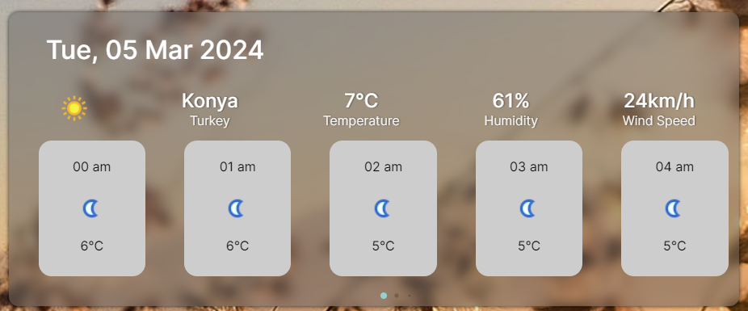
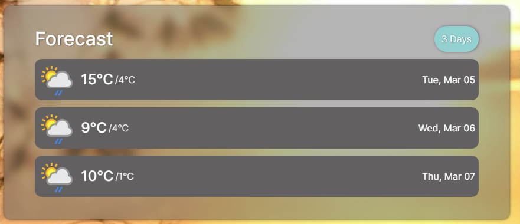
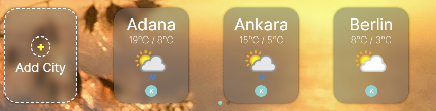
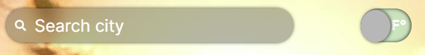

# Weather App

## Overview

This project is a comprehensive weather application built with React, showcasing real-time weather data, forecasts, and city-specific weather conditions. It integrates styled components for a dynamic and responsive design, ensuring a seamless user experience across various devices.

## Key Features

- Real-Time Weather Data: Utilizes APIs to fetch current weather conditions, including temperature, humidity, and wind speed, for selected cities.
  
- Forecast Weather: Provides a 3-day weather forecast, displaying maximum and minimum temperatures and weather icons for a quick overview.
  
- City Weather Cards: Users can add and view weather cards for different cities, each card displaying key weather indicators and an option to remove the city from the view.
  
- Responsive Swiper: Incorporates a swiper component for navigating through city weather cards, optimized for responsiveness with adjustable slides and spaces based on screen size.
- Temperature Unit Toggle: Includes a context for toggling temperature units between Celsius and Fahrenheit, catering to user preferences.
  
- Styling and Responsiveness: Employs styled components for styling, offering a clean and modern UI. Responsive design ensures compatibility with various screen sizes, from mobile devices to desktops.
- Modal Component: Features a modal component for adding new cities, enhancing interactivity and user engagement.
- This application is designed for weather enthusiasts who appreciate a detailed yet intuitive interface for monitoring weather conditions. Whether you're planning your day or checking the forecast for multiple cities, this app provides the necessary information at your fingertips.

For developers, this project demonstrates the effective use of React hooks, context for state management, styled components for styling, and integration with third-party libraries like Swiper and Axios for fetching data and enhancing UI components.

## Used Libraries

### Axios

### React-icon

### Styled Component

### Recaharts

### Swiper

# Figma Design File

### https://www.figma.com/file/6Sdqd3zYXGZacTMEOnMYNR/Untitled?type=design&node-id=0%3A1&mode=design&t=X07vtJh19sXustPo-1

# MVP File For Weather App

### 1. User Identification and Market Research

- **Define Target Audience:** Understand who your users are (e.g., general public, outdoor enthusiasts, farmers, maritime users).
- **Competitive Analysis:** Review existing weather apps to identify standard features and potential gaps to fill.

### 2. Core Features for MVP

Based on general user expectations for a weather app, consider including these core features:

- **Current Weather Conditions:** Display temperature, humidity, wind speed, and atmospheric pressure for the user's current location or selected locations.
- **Hourly and Daily Forecasts:** Provide short-term (next 24 hours) and long-term (3 days) weather forecasts including temperature highs and lows, precipitation chances, and weather conditions (sunny, cloudy, rainy, etc.).
- **Search and Save Locations:** Allow users to search for and save multiple locations for quick weather checks.

### 3. User Experience and Design

- **Simple and Intuitive Interface:** Ensure the app is easy to navigate, with a clear layout displaying the most critical weather information upfront.
- **Responsive Design:** Design the website to be mobile-friendly, ensuring it adjusts seamlessly across devices (smartphones, tablets, desktops).
- **Customization:** Allow users to customize settings, such as temperature units (Celsius or Fahrenheit)

### 4. Technical Considerations

- **Data Source:** I use WeatherAPI for now
- **Performance and Scalability:** Optimize for fast loading times and ensure the infrastructure can scale with user growth.
- **Location Services:** Integrate geolocation to automatically display weather data for the user's current location.

### 5. Legal and Compliance

- **Privacy Policy and Terms of Use:** Clearly outline how user data is used and stored, especially for location-based services.
- **Data Attribution:** Ensure compliance with the terms of service for your weather data provider, including proper attribution if required.

### 6. Testing and Feedback

- **Beta Testing:** Before full launch, conduct beta testing with a small group of users to gather feedback and identify any bugs or usability issues.
- **Feedback Mechanism:** Include a way for users to report issues or provide suggestions for improvements.

### 7. Future Enhancements (Post-MVP)

Once the MVP is stable and receiving user traction, consider adding features like:

- **Personalization:** Learning user preferences for weather information display.

Focusing on these MVP features will help you launch a functional, user-friendly weather app website that addresses the fundamental needs of your target audience while leaving room for expansion based on user feedback and technological advancements.
